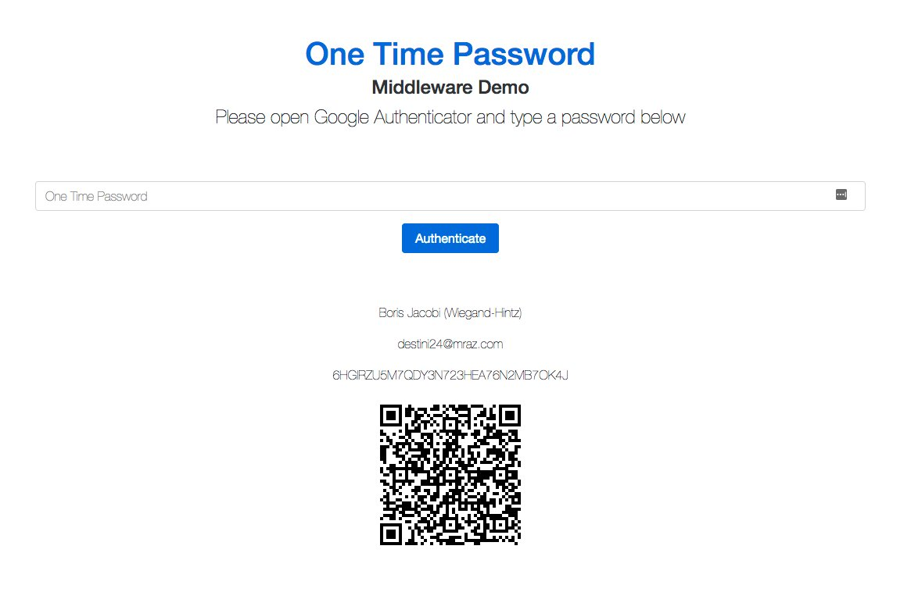

# Google2FA for Laravel

<p align="center">
    <a href="https://packagist.org/packages/pragmarx/google2fa-laravel"></a>
    <a href="LICENSE"></a>
    <a href="https://scrutinizer-ci.com/g/antonioribeiro/google2fa-laravel/?branch=master"></a>
    <a href="https://travis-ci.org/antonioribeiro/google2fa-laravel"></a>
</p>
<p align="center">
    <a href="https://packagist.org/packages/pragmarx/google2fa-laravel"></a>
    <a href="https://scrutinizer-ci.com/g/antonioribeiro/google2fa-laravel/?branch=master"></a>
    <a href="https://styleci.io/repos/94630851"></a>
    <a href="https://travis-ci.org/antonioribeiro/google2fa-laravel"></a>
</p>

### Google Two-Factor Authentication Package for Laravel

Google2FA is a PHP implementation of the Google Two-Factor Authentication Module, supporting the HMAC-Based One-time Password (HOTP) algorithm specified in [RFC 4226](https://tools.ietf.org/html/rfc4226) and the Time-based One-time Password (TOTP) algorithm specified in [RFC 6238](https://tools.ietf.org/html/rfc6238).

This package is a Laravel bridge to [Google2FA](https://github.com/antonioribeiro/google2fa)'s PHP package.

The intent of this package is to create QRCodes for Google2FA and check user typed codes. If you need to create backup/recovery codes, please check below.

### Recovery/Backup codes

if you need to create recovery or backup codes to provide a way for your users to recover a lost account, you can use the [Recovery Package](https://github.com/antonioribeiro/recovery). 

## Demos, Example & Playground

Please check the [Google2FA Package Playground](https://pragmarx.com/playground/google2fa#/).


Here's an demo app showing how to use Google2FA: [google2fa-example](https://github.com/antonioribeiro/google2fa-example).

You can scan the QR code on [this (old) demo page](https://antoniocarlosribeiro.com/technology/google2fa) with a Google Authenticator app and view the code changing (almost) in real time.

## Compatibility

| Laravel | [Google2FA](https://github.com/antonioribeiro/google2fa) | Google2FA-Laravel |
|---------|-----------|-------------------|
| 4.2     | <= 1.0.1  |                   |
| 5.0-5.1 | <= 1.0.1  |                   |
| 5.2-10.x | >= 2.0.0  | >= 0.2.0          |

Before Google2FA 2.0 (Laravel 5.1) you have to install `pragmarx/google2fa:~1.0`, because this package was both a Laravel package and a PHP (agnostic).   

## Demo

Click [here](https://pragmarx.com/playground/google2fa/middleware) to see the middleware demo:



## Installing

Use Composer to install it:

    composer require pragmarx/google2fa-laravel


## Installing on Laravel

### Laravel 5.5 and above

You don't have to do anything else, this package autoloads the Service Provider and create the Alias, using the new Auto-Discovery feature.

### Laravel 5.4 and below

Add the Service Provider and Facade alias to your `app/config/app.php` (Laravel 4.x) or `config/app.php` (Laravel 5.x):

``` php
PragmaRX\Google2FALaravel\ServiceProvider::class,

'Google2FA' => PragmaRX\Google2FALaravel\Facade::class,
```

## Publish the config file

``` php
php artisan vendor:publish --provider="PragmaRX\Google2FALaravel\ServiceProvider"
```

## Using It

#### Use the Facade

``` php
use Google2FA;

return Google2FA::generateSecretKey();
```

#### In Laravel you can use the IoC Container

``` php
$google2fa = app('pragmarx.google2fa');

return $google2fa->generateSecretKey();
```

## Middleware

This package has a middleware which will help you code 2FA on your app. To use it, you just have to:

### Add the middleware to your Kernel.php:

``` php
protected $routeMiddleware = [
    ...
    '2fa' => \PragmaRX\Google2FALaravel\Middleware::class,
];
```

### Using it in one or more routes:

``` php
Route::get('/admin', function () {
    return view('admin.index');
})->middleware(['auth', '2fa']);
```

### QRCode

This package uses the [Google2FA-QRCode package](https://github.com/antonioribeiro/google2fa-qrcode), please check it for more info on how to configure the proper QRCode generators for your use case.

### Imagick QRCode Backend

There are three available: **imagemagick** (default), **svg** and **eps**. 

You can change it via config:

``` php
/*
 * Which image backend to use for generating QR codes?
 *
 * Supports imagemagick, svg and eps
 */
'qrcode_image_backend' => \PragmaRX\Google2FALaravel\Support\Constants::QRCODE_IMAGE_BACKEND_IMAGEMAGICK,
```
 
Or runtime:

``` php
Google2FA::setQRCodeBackend('svg');
```

### Configuring the view

You can set your 'ask for a one time password' view in the config file (config/google2fa.php):

``` php
/**
 * One Time Password View
 */
'view' => 'google2fa.index',
```

And in the view you just have to provide a form containing the input, which is also configurable:

``` php
/**
 * One Time Password request input name
 */
'otp_input' => 'one_time_password',
```

Here's a form example:

```html
    <form action="/google2fa/authenticate" method="POST">
        <input name="one_time_password" type="text">

        <button type="submit">Authenticate</button>
    </form>
```

## One Time Password Lifetime

Usually an OTP lasts forever, until the user logs off your app, but, to improve application safety, you may want to re-ask, only for the Google OTP, from time to time. So you can set a number of minutes here:

``` php
/**
* Lifetime in minutes.
* In case you need your users to be asked for a new one time passwords from time to time.
*/

'lifetime' => 0, // 0 = eternal
```
Keep in mind that this uses the Laravel sessions in the background. If this number exceeds the value set in ``config('session.lifetime')`` you will still be logged out, even if your OTP lifetime has not expired.

And you can decide whether your OTP will be kept alive while your users are browsing the site or not:

``` php
/**
 * Renew lifetime at every new request.
 */

'keep_alive' => true,
```

## Manually logging out from 2Fa

This command will logout your user and redirect he/she to the 2FA form on the next request:

``` php
Google2FA::logout();
```

If you don't want to use the Facade, you may:

``` php
use PragmaRX\Google2FALaravel\Support\Authenticator;

(new Authenticator(request()))->logout();
```

## Throttling / Lockout after X attempts

Unless you need something really fancy, you can probably use Laravel's [route throttle middleware](https://laravel.com/docs/6.x/middleware) for that:
 
```php
Route::get('/admin', function () {
    return view('admin.index');
})->middleware(['auth', '2fa', 'throttle']);
```

## Stateless usage

```php
$authenticator = app(Authenticator::class)->bootStateless($request);

if ($authenticator->isAuthenticated()) {
    // otp auth success!
}
```

You can also use a stateless middleware: 

``` php
protected $routeMiddleware = [
    ...
    '2fa' => \PragmaRX\Google2FALaravel\MiddlewareStateless::class,
];
```

## 2FA and Laravel login via remember 

When Laravel login via remember is activated, the session is renovated and the 2FA code is required again. To solve this, add the ``LoginViaRemember`` listener in your ``App\Providers\EventServiceProvider``:

``` php
use Illuminate\Auth\Events\Login;
use PragmaRX\Google2FALaravel\Listeners\LoginViaRemember;

class EventServiceProvider extends ServiceProvider
{
    protected $listen = [
        Login::class => [
            LoginViaRemember::class,
        ],
    ];
...
```

## Events

The following events are fired:

- EmptyOneTimePasswordReceived
- LoggedOut
- LoginFailed
- LoginSucceeded
- OneTimePasswordExpired
- OneTimePasswordRequested

## Documentation

Check the ReadMe file in the main [Google2FA](https://github.com/antonioribeiro/google2fa) repository.

## Tests

The package tests were written with [phpspec](http://www.phpspec.net/en/latest/).

## Author

[Antonio Carlos Ribeiro](http://twitter.com/iantonioribeiro)

## License

Google2FA is licensed under the MIT License - see the [LICENSE](LICENSE) file for details

## Contributing

Pull requests and issues are more than welcome.
